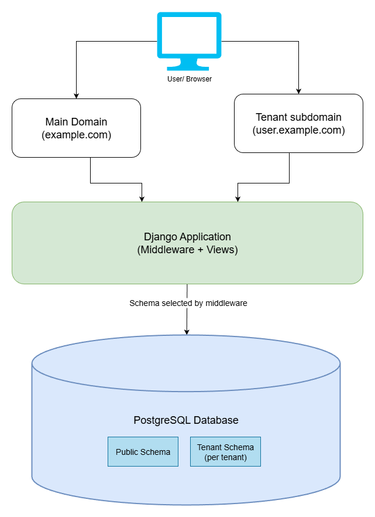

# 🏗️ Django Multitenant Blog Platform

[](https://github.com/amssdias/multitenant-blog-platform/actions/workflows/tests.yml)


## 🚀 Overview

This is a **Django Multitenant Blog Platform** where users can sign up on the **main domain**, and upon registration,
they get their own **subdomain** with an isolated schema to create and manage their own blog.

## 🧠 Key Concepts

- **Schema-based multitenancy** using PostgreSQL
- **Subdomain routing** per tenant
- **Isolated data per tenant**
- **Shared users table** on the public schema
- **CI-tested architecture**

## 🔥 Features

### 🌍 Main Domain (`example.com`)

- User registration & authentication
- Tenant provisioning on signup
- Subdomain assignment (`user.example.com`)

### 🧩 Tenant Subdomains (`user.example.com`)

- Automatic redirect after login
- Blog post creation & management
- Fully isolated PostgreSQL schema per tenant

### ⚙️ Technical Highlights

- Django + schema-based multitenancy
- PostgreSQL (schemas)
- Redis support
- Docker-ready
- GitHub Actions CI (tests on push & PR)


## 🏗️ Architecture

> Each user owns a tenant schema while authentication and tenant metadata live in the public schema.


## 🛠️ Installation & Setup

### 1️⃣ Clone the Repository

```sh
git clone https://github.com/yourusername/multitenant-blog.git
cd multitenant-blog
```

### 2️⃣ Install Dependencies

```sh
pip install pipenv
pipenv install --dev
```

### 3️⃣ Configure the Environment

Copy the example environment file and adjust values if needed:

```bash
cp .env.example .env
```

Required to run the project:

- Django settings (`DJANGO_SECRET_KEY`, `DJANGO_ALLOWED_HOSTS`)
- PostgreSQL connection (`DB_NAME`, `DB_USER`, `DB_PASSWORD`, `DB_HOST`, `DB_PORT`)
- Redis connection (`REDIS_PROTOCOL`, `REDIS_PORT`, `REDIS_PASSWORD`, `REDIS_DB_CELERY`)

Optional (only if you want to test email/Celery email tasks):

- SMTP settings (`EMAIL_HOST`, `EMAIL_PORT`, `EMAIL_USE_TLS`, `EMAIL_HOST_USER`, `EMAIL_HOST_PASSWORD`,
  `DEFAULT_FROM_EMAIL`)

### 4️⃣ Run Migrations

```sh
python manage.py migrate
```

### 5️⃣ Start the Development Server

```sh
python manage.py runserver --settings=bloggies.settings.settings_development
```

## 🖥️ Local subdomain setup

To enable subdomains locally, configure your hosts file:

👉 [Localhost multitenancy setup guide](https://github.com/amssdias/multitenant-blog-platform/wiki/Multitenancy-Localhost-Setup)


## 🧪 Testing & CI

- Automated tests run on every push request
- PostgreSQL-backed test environment
- GitHub Actions workflow: tests.yml

```shell
pipenv run python manage.py test --settings=bloggies.settings.settings_tests
```


## 🎯 Use Cases

- SaaS blog platforms
- Multi-tenant CMS systems
- Portfolio-ready Django architecture
- Learning reference for schema-based multitenancy


## 🧩 Built to demonstrate real-world Django multitenant architecture



This project is intentionally designed as a **production-style reference** for building
**schema-based multitenant applications** with Django.

It focuses on **architectural correctness and real constraints**, rather than shortcuts
commonly used in tutorials.

Specifically, it demonstrates:

- Schema-based data isolation using **PostgreSQL schemas**
- Subdomain-driven tenant resolution (`user.example.com`)
- A shared **public schema** for authentication and tenant metadata
- Clean separation between **public** and **tenant-specific** concerns
- A CI pipeline that validates the architecture using real services

The goal is to showcase how a real SaaS-style multitenant Django application can be structured,
tested, and reasoned about.

---
🚀 Happy Coding! 🎯

